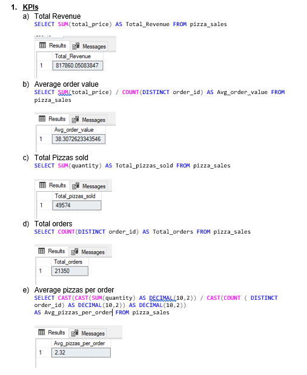
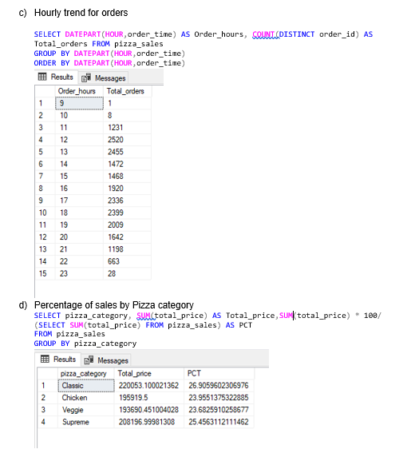
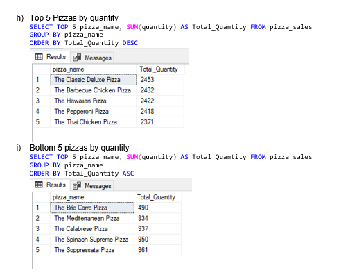

# Pizza Sales Analysis  
## Introduction
This is a Power BI project on sales analysis of one year for an imaginary pizza store. The project is to analyze and derive insights to answer crucial questions and help the store make data-driven decisions.

## Problem Statement
a) Calculate the following metrics:
1. Total Revenue- Sum of the total price of all pizza orders
2. Average order value- Average amount spent per order
3. Total pizzas sold- Sum of the quantities of all pizzas sold
4. Total orders- Total number of orders placed
5. Average pizzas per order- Average number of pizzas sold per order
   
b) Visualize various aspects of the pizza sales data to gain insights and understand key trends
1. Daily trend for total orders
2. Monthly trend for total orders
3. Percentage of sales by Pizza Category
4. Percentage of sales by Pizza size
5. Total Pizzas sold by Pizza Category
6. Top 5 Best Sellers by Revenue, Total Quantity and Total Orders
7. Bottom 5 Worst Sellers by Revenue, Total Quantity and Total Orders

## Skills Demonstrated
The following concepts have been used throughout the project:
- Importing data into MS SQL Server
- Creating a database in MS SQL Server
- Writing Queries
- Creating reports
- DAX
- Data cleaning using transforming data tools and power query functions
- Data visualization
- Page navigation
- Filters
- Buttons

  ## Analysis and Visualization
  The following are the queries to calculate the metrics required:
  
  
  
  The following are queries for the chart requirements:
  
   
  
   

  The following shows the Power BI dashboards:

  
  
  
  This dashboard shows the KPIs, which are at the top, the bar chart for the daily trend of total orders, the line graph for the monthly trend, the donut chart for the 
  percentage of sales by pizza category and size, and the funnel chart for total pizzas sold by category.
  

  
  
  This dashboard shows the best and worst pizzas by revenue, quantity and total orders.
  At the top left corner, there are two buttons, the Home and Best/Worst Sellers, which are used to navigate between the two pages. 
  
 
  
  
